# 🔐 Cybersecurity Threat Intelligence RAG (Retrieval-Augmented Generation)

This project is an interactive **Streamlit web application** that uses **LlamaIndex** + **ChromaDB** + **Groq LLM** to fetch, process, and query **real-world cybersecurity threat intelligence** from trusted sources like **CISA**, **NVD**, and security vendor advisories.

## 🚀 Features
- Fetches live data from trusted cybersecurity URLs.
- Splits content into embeddings and stores in a **local persistent Chroma vector store**.
- Lets you ask natural language questions about vulnerabilities, CVEs, and threats.
- Returns concise answers **with clickable sources**.
- Fully open-source and runs locally.

## 🏗️ Architecture


1. **User Inputs** — Number of URLs, URLs, and a natural language question in the Streamlit UI.
2. **Web Scraper** — Fetches HTML and converts to clean text.
3. **Chunking & Embedding** — Splits text into chunks and generates embeddings using `sentence-transformers/all-MiniLM-L6-v2`.
4. **Vector Store (Chroma)** — Stores embeddings persistently on disk for fast similarity search.
5. **Retriever + LLM (Groq)** — Retrieves relevant chunks and generates a concise answer.
6. **Streamlit Output** — Displays the answer and clickable sources.

## 📦 Installation

```bash
git clone https://github.com/<your-username>/cybersecurity-threat-rag.git
cd cybersecurity-threat-rag
pip install -r requirements.txt
```

## 🔑 Environment Variables
```env
GROQ_API_KEY=your_groq_api_key_here
```

## ▶️ Run the App
```bash
streamlit run main.py
```

## 🛠️ Requirements
- Python 3.9+
- Streamlit
- LlamaIndex
- ChromaDB
- Groq API Key

```mermaid
flowchart LR
    %% ==== Sections ====
    subgraph UI["🖥️ User Input"]
        A[User enters URLs & Question<br/>via Streamlit UI]
    end

    subgraph Ingestion["🌐 Data Ingestion"]
        B[SimpleWebPageReader<br/>Fetch & Clean Web Pages]
        C[SimpleNodeParser<br/>Split into Chunks]
    end

    subgraph Embedding["🔍 Embedding & Storage"]
        D[HuggingFace Embeddings<br/>Generate Vectors]
        E[Chroma Vector Store<br/>Persistent Storage]
    end

    subgraph Retrieval["🤖 Retrieval & LLM"]
        F[Retrieve Relevant Chunks]
        G[Groq LLM<br/>Generate Answer + Sources]
    end

    subgraph Output["📄 Output"]
        H[Final Answer Displayed<br/>with Clickable Sources]
    end

    %% ==== Connections ====
    A --> B
    B --> C
    C --> D
    D --> E
    A --> F
    E --> F
    F --> G
    G --> H
```



## 📚 Example Trusted Sources
- https://www.cisa.gov/news-events/cybersecurity-advisories
- https://nvd.nist.gov/vuln/full-listing
- https://unit42.paloaltonetworks.com/
- https://www.crowdstrike.com/blog/category/threat-intel/
